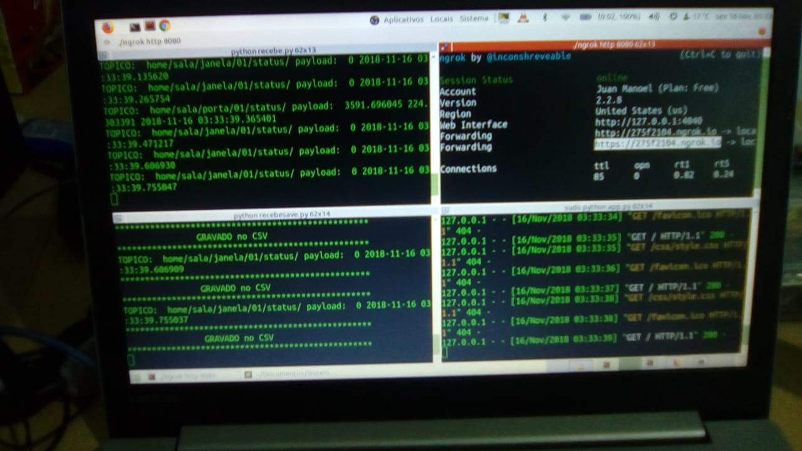
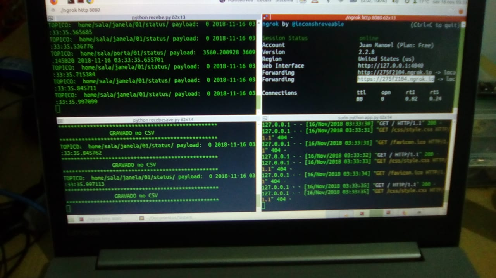
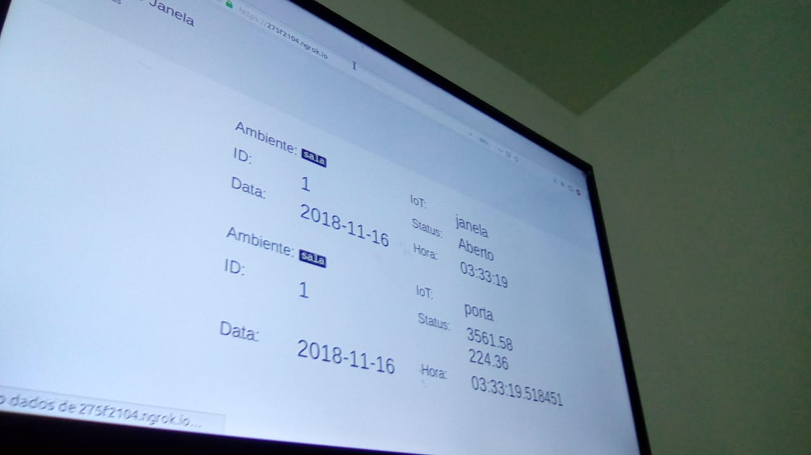
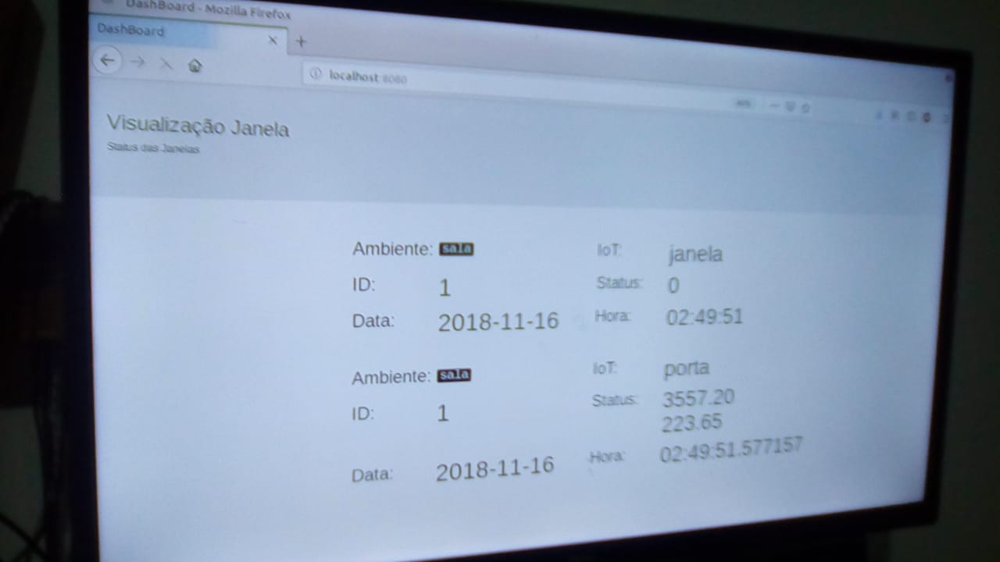
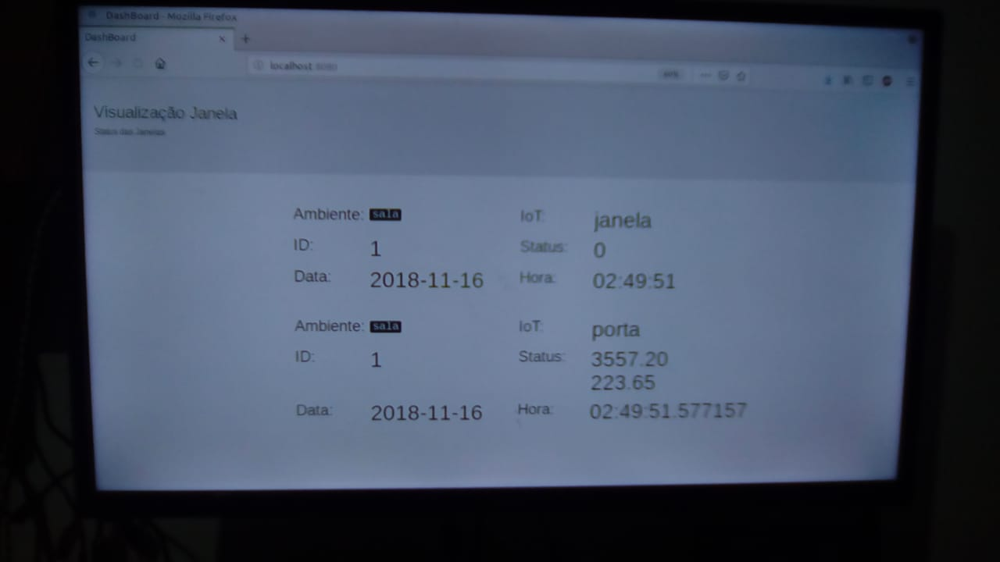

## Sensores e Desenhos
### Sensores de Passagem Desenho

### Sensores de Passagem Aplicado 

### Sensor de Janela Desenho

### Sensor de Janela Aplicado 

### Sensores 

### Web Dashboard Viewer

### Nota Extra
- O sensor de passagem ainda não foi implementado na dashboard 
- Esta em desenvolvimento. 

