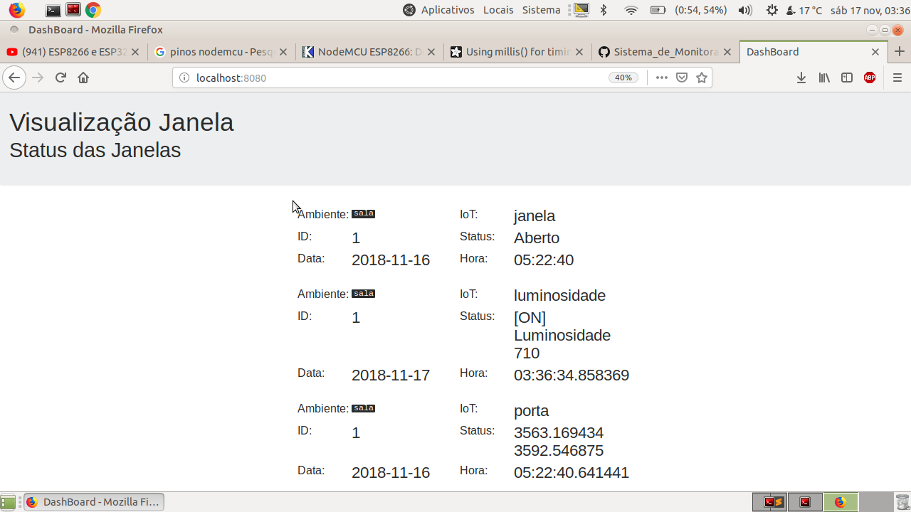
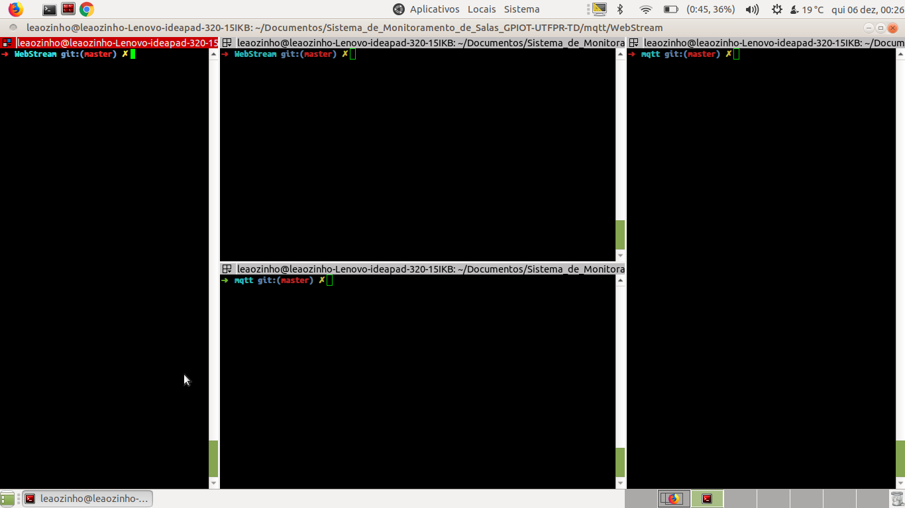

# Sistema de Monitoramento de Sala
## Grupo de Pesquisa de IoT da UTFPR-TD
### Participantes: 
- Juan Manoel (Eng Computação) 
- Debora Rodrigues (Eng Eletronica) 
- Eliandro Poli (Eng Computação) 
- Vinicios (Eng Computação). 
## Problematica: 
* Se janela esta aberta na sala, pode chover e molhar o ambiente
* Se luz estiver ligada e não tiver ninguem usando é um gasto maior
* Se tem ou não tem pessoas na salas.

## Objetivo
* Monitorar o Ambiente com base nos parementros da problematica

## Prototipo 
* Construir uma dashboard para ler os dados salvos do IoT
* Prototipar um IoT com switch para ler status:
-  porta 
-  janela ======> OK Completo com dashboard e leitura do sensor
- sensor de luz 
- sensor de movimento

## DashBoard de Monitoramento de Status de janela

## Atuador(extra)
Quando tiver chovendo ou começando a chover, detector chuva AND tem alguem na sala avisa na sala para fechar janela

## Tutorial Start Projetct !

[![Link]](https://www.youtube.com/watch?v=HmgL5kCg-3Y)

## Link Referencia

https://pastebin.com/Qx07Q0Gz

